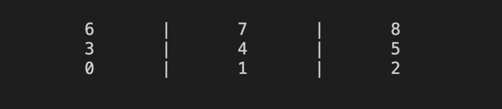

# PA02 - Tic-Tac-Toe

	Course: Web Application Development Using Python (ICTC6)
	Revision: 3
	Last updated: 17-11-2020
	Submission: Submissions accepted until 21-11-2020 11:59pm

## The Game

Tic-Tac-Toe is a two-player turn-based game that is played on a 3x3 square grid.

Each player, in turn places a marker `X` or `O` on the board. The objective of the game is to place three markers in a horizontal, vertical or diagonal pattern.



## Game Design

For this practical assigment you will be building a game you can play on the command line.

The objective of building this game is to boost your programming skills and understanding of programming logic. You will be using basic Python statements, data structures, flow control statements, and functions.

## General Notes

* You are provided a file [`PA02.py`](./PA02.py) with a structure for the game implementation. 

* **All of the function signatures** have already been defined, you just need to code in the implementation. You need to remove the **pass** statements.

* **Read the sections below carefully!** It is very important to understand the global variables and functions you need for the game.

* We will use 'X' and 'O' as player markers on the board. '#' is an empty space.

* Remember to document your code properly.

* Follow the Python naming convention for variable and function names.

## Global Variables

In the list below you find the global variables you need along with a short description. Depending on your implementation, you may need more variables.

* `is_running = False` -- This boolean variable is used to keep track of the game loop.

* `players = None` -- This tuple will always contain the markers for the players. For example `players[0]` is the marker for **player1**.

* `player_turn = 1` -- This integer will be used to keep track of the player turns. Remember that in Tic-Tac-Toe players alternate turns making one move each.

* `board = []` -- This list will keep track of markers on the board. `board[0]` is the first position on the board, and it can contain `X`, `O`, or `#`.

## Functions

In the list below you will find the function signatures in the **PA02** Python script along with a short description.

* `display_board(board)` -- This function takes in a board as an argument and does not return any value. This function prints the board out to the screen.
	* **Hint:** You can use multiple print lines to print a pretty board. **Below you can find an example.**

	```python
	# Print the game board.

    print("\n")
    print(f"\t{board[6]}\t|\t{board[7]}\t|\t{board[8]}")
    print(f"\t{board[3]}\t|\t{board[4]}\t|\t{board[5]}")
    print(f"\t{board[0]}\t|\t{board[1]}\t|\t{board[2]}")
    print("\n")
	```

* `place_marker(board, player, position)` -- This function takes in three arguments a `board`, a `player` and a `position` on the board. It places the player marker at the given position on the board.

* `check_space(board, position)` -- This function takes in a `board` and a `position` as arguments and returns `True` if the `position` on the board is empty, otherwise returns or `False`.

* `player_choice(player, board)` -- This function takes in a `player` and a `board` as arguments and returns the player choice. Use a loop to check that player choice is valid (a value between 0-8), and that the chosen position is empty.
	* **Hint:** You can use your `check_space(board, position)` function to check if a specific position on the board is empty.

* `assign_players()` -- This function takes no arguments, and returns a tuple containing the player makers. This function should ask the player **player1** to choose a marker, `X` or `O` and assigns the other to **player2**.

* `check_board_full(board)` -- This function takes in a `board` as an argument and returns `True` if you only have one empty space remaining on the board, otherwise returns `False`.

	* **Hint:** You can check how many `#` are remaining on the board.

* `check_win(board, marker)` -- This function takes in a `board` and a `marker` as arguments and return `True` if the `marker` has a win in a horizontal, vertical or diagonal pattern. Otherwise returns `False`.

* `replay()` -- This function takes no arguments and returns `True` after asking if player wishes to start a new game. Otherwise returns `False`.

* `initalize_game()` -- This function takes no arguments and returns no values. You can use this function to setup the global variables needed for the game.
	* **Hint:** You can use `board = ['#']` to initialize an empty board.
	* **Hint:** You can use the `assign_players()` function to initialize `players`.
	* **Hint:** You can initilize the `player_turn` variable to `1`. Player 1 gets to go first!
	* **Hint:** Remember to the game loop flag to `True`.