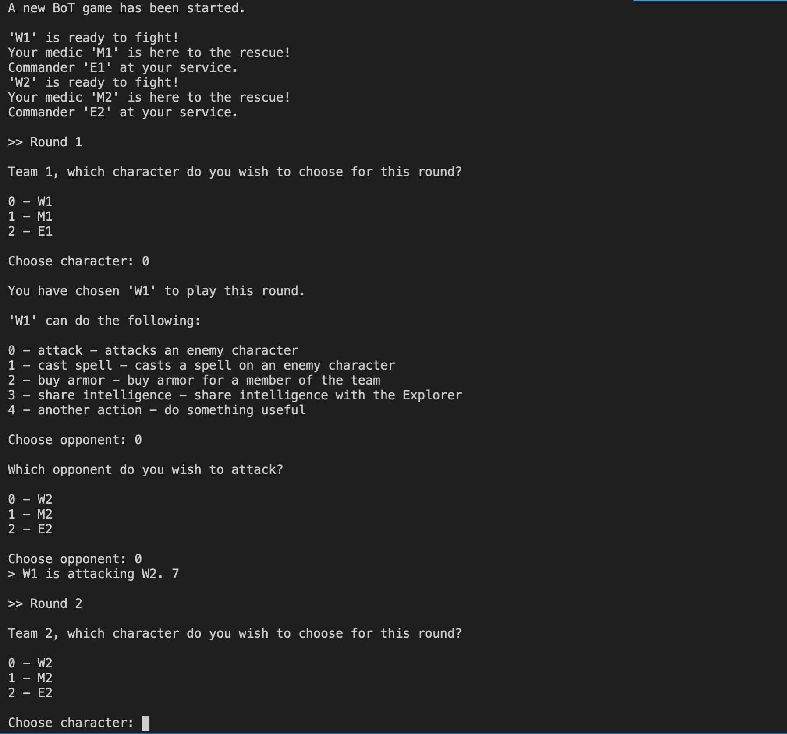

# PA03 - Battle of Teams

	Course: Web Application Development Using Python (ICTC6)
	Revision: 2
	Last updated: 25-11-2020
	Submission: Submissions accepted until 05-12-2020 11:59pm


## General Notes

* You are provided a folder with a basic structure for the game objects in [`bot/`](./bot/).
* **Read the sections below carefully!** It is very important to understand the structure of your classes and inheritance model.
* Remember to document your code properly. Refer to the **Code Review Checklist** for the assessment rubric.

## The Game

Battle of Teams is a multiplayer turn-based role-playing game played against the computer. In turns the players  choose a character from their team to play that round. Each team consists of three characters (one of each of the characters below). After a particular player has chosen a character to make their next move, the player must choose an action available for that chosen character. For example a **Warrior** can `attack(character)` but a **Medic** can `heal(character)`.

### Game Characters

The game has three basic characters. All of the characters are subclasses of the class **GameCharacter**. Remember to carefully understand the class implementation before you start coding.

#### Common Attributes and Methods

There are some common attributes and methods shared across all characters.

All characters have the following **attributes**:

* `name` -- Represents the name of the character.
* `health` -- A value between 0 - 100 representing the character health.
* `strength` -- A value between 0 - 100 representing the character strength.
* `magic` -- A value between 0 - 100 representing the character magic level.

All characters have the following **methods**:

* Getter and setters for all of the common character attributes.
* `attack(character)` -- This method attacks the opponent character chosen for this round.
* `cast_spell_on(character)` -- This method tries to cast a spell on the opponent character chosen for this round.
* `__str__()` -- An override which pretty prints the character stats.


#### The Explorer

The **Explorer** character helps other characters find gold which gives them better strength.

The **Explorer** character has the following **attributes**:

* `gold` -- Represents the amount of gold the explorer successfully managed to find.
* `foresight` -- A value between 1 - 3 representing the foresight level for the explorer. Default value is 1.Read below. 

The **Explorer** character has the following **methods**:

* `go_on_quest(map, position)` -- This method receives a random map on which the explorer is placed on a position, randomly. The explorer can move to explore other locations on the map, given that the number of steps an explorer can move in any direction is equal or less than their foresight level. After returning from a quest, the explorer loses one foresight level.
  * Hint: Read and learn how to use the CSV module in Python. [Read more.](https://docs.python.org/3.8/library/csv.html)

For example an explorer with `foresight = 3` on the map below will be able to collect different amounts of gold as a reward. 

```python

# For example, on the input map below, your explorer is placed on the random starting position (0,0) 

random_map = [
        ['E', 'X', '$', '$'],
        ['$', '$', 'X', 'X'],
        ['X', 'X', '$', 'X'],
        ['$', 'X', 'X', '$'],
      ]


# X is land.
# $ is gold. 
# E is your explorer.

# On the map above, our explorer,
# > with a foresight level of 3, can collect a reward of 7 gold units.
# > with a foresight level of 2, can collect a reward of 4 gold units.

# Input maps are always of the same size (4 columns, 2 rows).
```


* Implement another method for your explorer character. This method should modify at least one attribute from this class (use the method `go_on_quest(map, position)` and the attribute `gold` for example). 


#### The Medic

The **Medic** helps heal other characters. The medic cannot attack other players and yield damage, but can instead heal other characters on the team.

The **Medic** character has the following **attributes**:

* `nanobots` -- Represents the number of nanobots available for the medic to use.
* `nanobots_accuracy_level` -- Defaults to 0, and represents the level of accuracy for the nanobots. Read below.

The **Medic** character has the following **methods**:

* `back_to_the_future(datetime)` -- This method receives a date and a time in the future. The medic travels in time to retrieve advanced nanobots that help the medic heal other characters more efficiently. The number of nanobots returned with our medic after every trip to the future is equal to the microseconds difference between our time in the future and now. Every time the medic takes a trip back in time, the `nanobots_accuracy_level` increases by 1.
  * Hint: Read about the Python `datetime` module and the `timedelta` class.

* Implement another method for your medic character. This method should modify at least one attribute from this class (use the method `go_on_quest(map, position)` and the attribute `gold` for example).

#### The Warrior

The **Warrior** character deals the most damage to their opponents. They are very resilient to attacks from other characters, but not to other warriors.

The **Warrior** character has the following **attributes**:

* `popularity` -- A integer value representing the popularity of the warrior.

The **Warrior** character has the following **methods**:

* `buy_armor(gold, member)` -- This method receives `gold` and a `member` as input. The warrior then issues a command to buy armor for that team member. A random shield value between `0% - 20%` is returned. This random shield value is added to the health value for that team member. This also increases the warriors popularity level by the same amount.

* `share_intelligence()` -- This method increases the explorer's foresight level by 1/10th of the warrior's popularity level.

* Implement another method for your warrior character. This method should modify at least one attribute from this class (use the method `go_on_quest(map, position)` and the attribute `gold` for example).

## Sample Gameplay

Below you will find a screenshot of how the main game loop looks like. Please have a look at it to better understand the game design.

